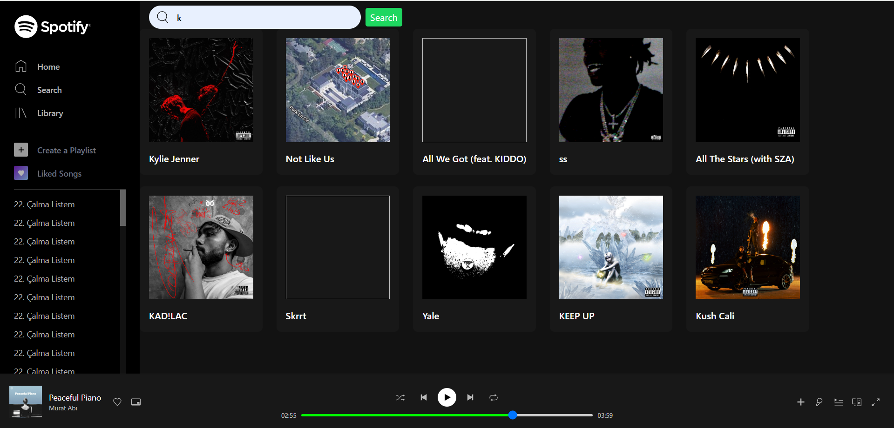

# Music Recommendation System



## Overview
This project is a **music recommendation system** that leverages **Spotify's API** for song search and metadata retrieval and **YouTube's API** for streaming. The backend is built using **Flask (Python)**, while the frontend is developed with **React and TypeScript**. The application suggests songs based on audio features using a **K-Nearest Neighbors (KNN) model**.

## Features
- **Search for songs** using the Spotify API
- **Get song metadata** including title, artist, and album information
- **Get song recommendations** based on similar audio features
- **Fetch YouTube links** for searched songs
- **Stream songs as MP3** using `yt-dlp`

## Tech Stack
### Frontend
- **React** (with TypeScript)
- **CSS/Styled Components**
- **REST API Integration**

### Backend
- **Flask (Python)**
- **Spotipy** (Spotify API Wrapper)
- **ytmusicapi** (YouTube Music API Wrapper)
- **yt-dlp** (For streaming songs from YouTube)
- **scikit-learn** (Machine Learning for recommendations)
- **Pandas** (Data handling)

## Machine Learning Model
The recommendation system uses a **K-Nearest Neighbors (KNN) model** to find similar songs based on extracted audio features.

### Model Details
- **Dataset**: A preprocessed dataset of songs stored in `mergedFile.csv`.
- **Features Used**: Acousticness, danceability, duration, energy, instrumentalness, key, liveness, loudness, mode, speechiness, tempo, time signature, valence.
- **Algorithm**: K-Nearest Neighbors (**KNN**) with cosine similarity as the distance metric.
- **Model Storage**: The trained model is saved as a **pickle file (`recommendation_model.pkl`)** for efficient reuse.

### Model Training Process
1. **Preprocessing**: Load and clean the dataset, selecting relevant audio features.
2. **Training**: Fit the KNN model with the song features.
3. **Saving the Model**: Serialize the trained model using `pickle`.
4. **Prediction**: Given a song’s audio features, the model finds the 15 most similar songs.

## Installation and Setup
### Prerequisites
- Python 3.7+
- Node.js
- Spotify Developer Account (for API credentials)

### Steps
1. Clone the repository:
   ```sh
   git clone https://github.com/roland7734/SpotifyClone.git
   ```
2. Install backend dependencies:
   ```sh
   pip install -r requirements.txt
   ```
3. Set up **Spotify API credentials** in `.env`:
   ```sh
   SPOTIPY_CLIENT_ID=your_key
   SPOTIPY_CLIENT_SECRET=your_key
   ```
4. Run the backend:
   ```sh
   python app.py
   ```
5. Navigate to the frontend folder and install dependencies:
   ```sh
   cd frontend
   npm install
   ```
6. Run the frontend:
   ```sh
   npm start
   ```

## API Endpoints
| Endpoint | Method | Description |
|----------|--------|-------------|
| `/api/search` | POST | Search for songs |
| `/api/stream` | GET | Stream a song from YouTube |
| `/api/recommend/<trackId>` | GET | Get song recommendations |
